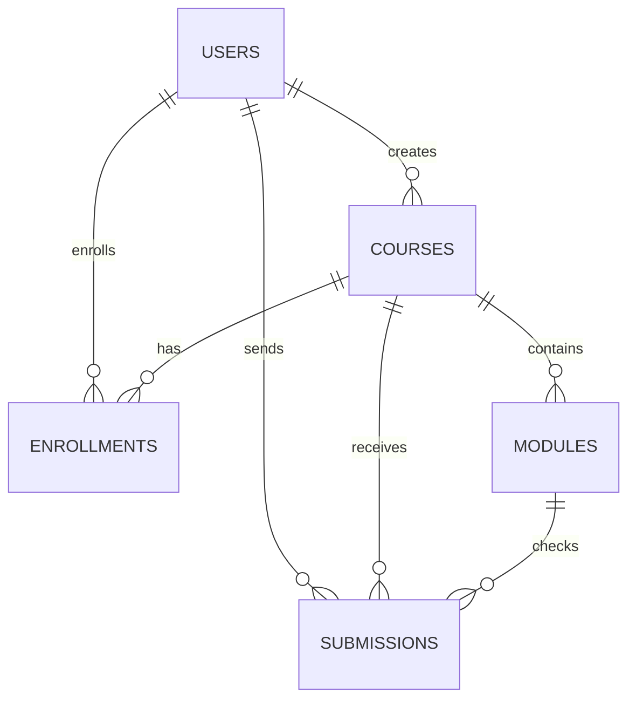

# Database Design

## Основные сущности

1. `users`
2. `courses`
3. `modules`
4. `enrollments`
5. `submissions`

## ER-идея

## `users`

| Поле | Тип | Назначение |
|---|---|---|
| id | Integer PK | Идентификатор |
| username | String(64), unique | Имя пользователя |
| email | String(120), unique | Почта |
| password_hash | String(255) | Хеш пароля |
| role | String(20) | student / teacher / admin |
| is_active | Boolean | Активен ли аккаунт |
| created_at | DateTime | Дата создания |
| updated_at | DateTime | Дата обновления |

## `courses`

| Поле | Тип | Назначение |
|---|---|---|
| id | Integer PK | Идентификатор курса |
| title | String(200) | Название |
| slug | String(200), unique | URL-идентификатор |
| short_description | Text | Краткое описание |
| full_description | Text | Полное описание |
| difficulty | String(32) | beginner / middle / hard |
| cover_image | String(255) | Обложка |
| is_published | Boolean | Опубликован ли курс |
| author_id | Integer FK users.id | Автор курса |
| created_at | DateTime | Создан |
| updated_at | DateTime | Обновлён |

## `modules`

| Поле | Тип | Назначение |
|---|---|---|
| id | Integer PK | Идентификатор |
| course_id | Integer FK courses.id | Курс |
| title | String(200) | Заголовок блока |
| module_type | String(20) | theory / practice |
| position | Integer | Порядок |
| theory_content | Text | Текст теории |
| practice_prompt | Text | Условие практики |
| practice_stub | Text | Шаблон / подсказка |
| created_at | DateTime | Дата создания |

## `enrollments`

| Поле | Тип | Назначение |
|---|---|---|
| id | Integer PK | Идентификатор |
| user_id | Integer FK users.id | Кто записался |
| course_id | Integer FK courses.id | На какой курс |
| status | String(20) | active / completed / dropped |
| progress_percent | Integer | Прогресс 0..100 |
| enrolled_at | DateTime | Когда записался |
| completed_at | DateTime nullable | Когда закончил |

Уникальная пара: `(user_id, course_id)`.

## `submissions`

| Поле | Тип | Назначение |
|---|---|---|
| id | Integer PK | Идентификатор |
| user_id | Integer FK users.id | Кто отправил |
| course_id | Integer FK courses.id | Курс |
| module_id | Integer FK modules.id | Практический блок |
| submitted_text | Text | Текст решения |
| verdict | String(32) | accepted / wrong_answer / rejected / pending |
| feedback | Text | Комментарий проверки |
| created_at | DateTime | Когда отправлено |

## Что можно добавить позже

- `lesson_progress`
- `course_tags`
- `announcements`
- `attachments`
- `submission_logs`

## Рекомендуемый жизненный цикл

1. Пользователь регистрируется -> запись в `users`
2. Записывается на курс -> запись в `enrollments`
3. Открывает курс -> чтение `courses` и `modules`
4. Отправляет решение -> новая запись в `submissions`
5. Сервер проверяет решение -> обновляет `verdict` и `feedback`
